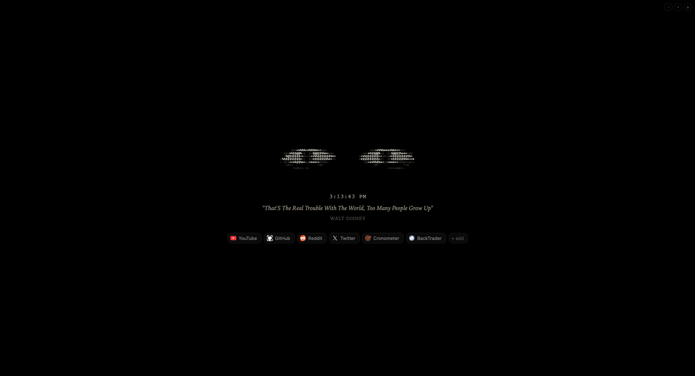

# AMOLED New Tab Page

An ultra-clean, battery-friendly new tab page for Chromium browsers featuring animated ASCII eyes, live clock, inspirational quotes, configurable shortcuts, custom themes, and rich customization designed specifically for OLED / AMOLED displays.



## Highlights & Features

- **Interactive ASCII Eyes**:
  - 7 unique eye style expressions: **Classic**, **Sleepy**, **Wide**, **Squint**, **Glare**, **Close-set**, **Wide-set**, plus a **Random per tab** mode.
  - 5 ASCII density ramps: **Classic** (`· ~ o x + = * % $ @`), **Minimal** (`· : * # @`), **Blocks** (`░ ▒ ▓ █`), **Binary** (`0 1`), and **Matrix** (`· ﾊ ﾐ ﾋ ｳ ｼ ﾅ 0 1`).
  - Gaze tracking: Pupils track cursor movement smoothly in real-time (optional toggle).
  - Natural animations: Configurable blink rates (**Normal**, **Calm**, **Frequent**, or **Off**), natural idle wandering drift, and double-blink on click.
  - Reactive gaze: Averts gaze and squeezes shut on right-click; looks up/down on scroll-wheel events.
  - Dual-layer rendering to eliminate flicker.
- **Ambient Mouse Aura & Click Shockwaves**:
  - **Mouse Cursor Aura**: A soft, ethereal radial phosphor glow tracking the mouse, dynamically illuminated in your current theme's accent color.
  - **Geometric Click Ripples**: Smooth animated shockwave rings on click that expand and dissolve into the deep black background.
  - **Accent Sonar Pulse**: Right-clicking emits a dual-ring glowing accent shockwave.
- **Animated Right-Click Context Menu**:
  - Glassmorphic translucent dark menu with smooth micro-bloom spring animation.
  - Quick actions on empty space: Open Settings, Cycle Eye Expressions, Toggle CRT Glow, Refresh Quote, Add Shortcut.
  - Contextual shortcut actions: Edit, Clear Slot, Delete.
- **Kinetic Scroll Dynamics & Custom Scrollbars**:
  - Elastic kinetic spring displacement on mouse wheel scroll with smooth recovery.
  - Custom slim AMOLED dark scrollbars across all modals and settings.
- **Themes & Accent Colors**:
  - Background themes: **Pure AMOLED Black** (`#000000`), **Midnight Charcoal**, **Abyss Navy**, or **Matrix Dark**.
  - Vibrant accent color tints: **Warm White**, **Cyber Amber**, **Terminal Green**, **Ice Cyan**, **Synthwave Purple**, and **Sunset Rose**.
  - Phosphor / CRT Glow: Subtle neon luminescence on eyes and clock.
- **Live Clock & Date**:
  - 12-hour or 24-hour time formats.
  - Optional seconds counter toggle.
  - Optional date display with multiple formats (**Medium**, **Full**, or **ISO Numeric**).
- **Inspirational Quotes & Custom Mottos**:
  - Fetches random quotes from [Quotable](https://api.quotable.io) or [DummyJSON](https://dummyjson.com) with offline fallbacks (`fallbacks.json`).
  - Custom Motto mode: Set your own personal motto and author text.
  - Discreet inline copy button right behind the quote with visual "Copied" feedback.
- **Customizable Shortcuts**:
  - Up to 8 launch chips with automatic favicon resolution, letter badge mode, or text-only mode.
  - Drag-and-drop reordering.
  - Optional "Open in new tab" left-click toggle.
  - Context menu to edit, clear, or delete.
  - Modal editor with automatic `https://` prefixing and URL validation.
- **Custom Zoom & Scaling**:
  - Global scaling from 70% to 200% in 10% steps via settings slider or corner `−`/`+` buttons (with toggle to hide corner buttons).
  - Preferences persisted across sessions via `chrome.storage.sync`.
- **Comprehensive Tabbed Settings Panel**:
  - Accessible via the gear icon (`⚙`) in the top right, pressing <kbd>s</kbd> or <kbd>,</kbd>, or double-clicking the background.
  - Organized tabs: **Appearance**, **Eyes**, **Clock & Quote**, **Shortcuts**, and **Data**.
  - Backup & Restore: Export configuration to JSON, import backups, and reset to defaults.
  - Keyboard accessible (`Escape` closes all modals, menus, and overlays).

## Installation

1. Clone or download this repository.
2. Open your Chromium browser (Chrome, Brave, Edge, Arc) and navigate to `chrome://extensions`.
3. Enable **Developer mode** in the top right corner.
4. Click **Load unpacked** and select the repository root directory (containing `manifest.json`).
5. Open a new tab to start using the extension.

> For detailed installation guidance, see [docs/install.md](docs/install.md).

## Usage & Controls

| Component | Control / Gesture | Action |
| --- | --- | --- |
| **Eyes** | Mouse move | Pupils follow cursor (when enabled) |
| | Idle | Natural wandering & periodic blink |
| | Scroll wheel | Kinetic scroll reaction, looks up/down then blinks |
| | Left-click | Double blink & geometric click ripple |
| | Right-click | Averts gaze, sonar shockwave, opens sleek context menu |
| **Cursor Aura** | Mouse move | Soft accent-colored phosphor aura illuminates cursor |
| **Quote** | Hover near quote | Reveals discreet copy icon right behind quote |
| | Click copy icon | Copies `<quote> — <author>` to clipboard |
| **Shortcuts** | Left-click | Open link (current tab or new tab based on settings) |
| | Middle-click / `Ctrl`/`Cmd`+Click | Open link in new tab |
| | Drag & drop | Reorder chips |
| | Right-click | Open animated context menu (Edit, Clear, Delete) |
| | `+ add` button | Add a new shortcut |
| **Background** | Right-click | Quick actions menu (Settings, Cycle Eyes, Toggle Glow, New Quote) |
| | Double-click | Quick open Settings modal |
| **Zoom** | `−` / `+` buttons | Adjust scale by 10% |
| | Settings slider | Fine-tune zoom between 70% and 200% |
| **Settings** | `⚙` (top-right) | Open tabbed settings modal |
| | Hotkey <kbd>s</kbd> or <kbd>,</kbd> | Toggle settings modal |
| **General** | `Escape` key | Close any open modal, menu, or overlay |

> For more details on usage, see [docs/usage.md](docs/usage.md).

## Architecture & Tech Stack

Built strictly with vanilla Manifest V3 standards—no bundlers, no build steps, and no third-party runtime dependencies:

```
├── manifest.json       # Chrome Manifest V3 configuration & permissions
├── preinit.js          # Synchronous CSP-compliant pre-paint script
├── newtab.html         # Clean DOM shell (eyes, clock, quote, shortcuts, modals)
├── newtab.css          # AMOLED styling, aura, ripples, glass menu, tabbed settings
├── newtab.js           # Clock, quote, shortcuts, aura, ripples, scroll physics, sync
├── eyes-display.js     # Multi-variant & density-ramp ASCII eye animation engine
├── storage.js          # Settings & shortcuts persistence with chrome.storage.sync
├── ascii.js            # Text utilities & legacy ASCII functions
├── fallbacks.json      # Bundled offline fallback quotes
├── icons/              # Extension icons (16px, 48px, 128px)
├── scripts/            # Helper scripts (e.g. icon generation)
└── tests/              # Unit tests with Node's built-in test runner
```

> See [docs/architecture.md](docs/architecture.md) for deep-dive technical details.

## Testing

Tests run using Node's built-in test runner (Node 18+ required):

```bash
npm test
```

or directly:

```bash
node --test tests/*.test.js
```

## License

MIT License. Feel free to customize and enjoy your AMOLED new tab experience!
